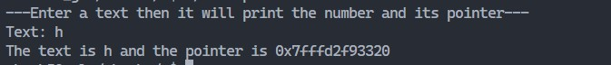

# Special lab 1: Text and Pointer: specs

In this lab you need to prompt the user for a string (char \*), and then print its pointer

For example:
<br/>



The text that you will print after the user has entered a text should be exactly like this:

```
The text is {text} and the pointer is: {pointer}
```
